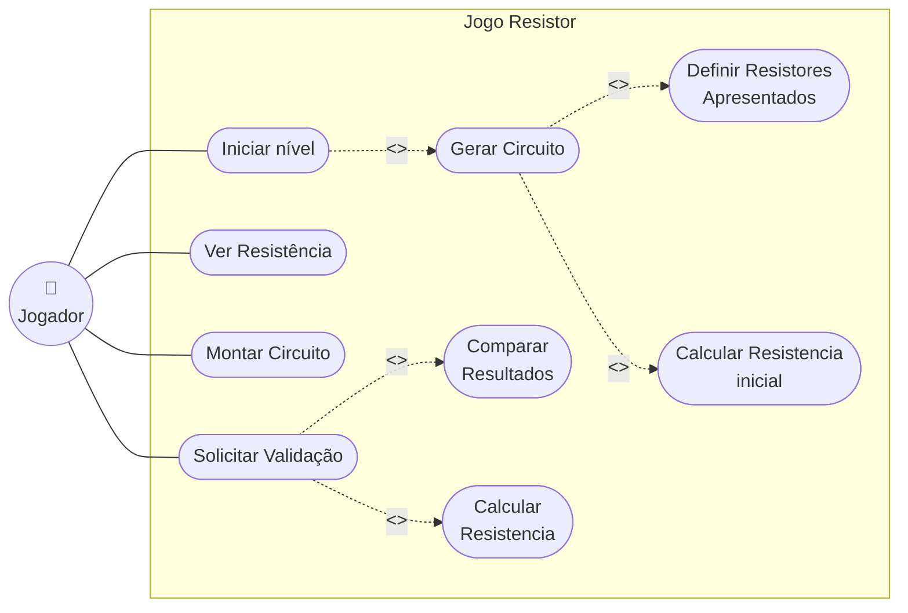

#  Jogo de Resistência Equivalente

##  Sobre o Projeto
Este é um jogo educativo desenvolvido em **C++** com interface gráfica em **Qt**, criado como projeto para a disciplina de Programação Orientada a Objetos. O objetivo principal é desafiar o jogador a montar circuitos elétricos utilizando associações em série e paralelo para atingir um valor de resistência alvo.

##  Como Funciona
Em cada nível, o jogo fornece um **Valor Alvo de Resistência Equivalente (R_eq)** e uma "caixa" contendo vários resistores com valores predefinidos. 
O jogador deve organizar e conectar esses resistores na área de montagem para criar um circuito que resulte no valor exato pedido.

##  Principais Funcionalidades
- **Geração Aleatória com Garantia de Solução:** O motor do jogo não utiliza fases estáticas. Ele gera aleatoriamente um circuito válido por baixo dos panos, calcula sua resistência e depois "desmonta" as peças para o jogador resolver. 
- **Níveis de Dificuldade:** O algoritmo ajusta a complexidade das associações (quantidade de malhas e nós) de acordo com o nível escolhido.
- **Resistores Iscas:** Para aumentar o desafio, resistores extras que não faziam parte do circuito original gerado são misturados no inventário do jogador.

---

##  Análise de Modelo (Domínio do Problema)

* **Componente Elétrico:** A abstração base do jogo. Tudo o que tem resistência é um componente.
* **Resistor:** A entidade básica, com um valor fixo de resistência em Ohms.
* **Associação (Circuito):** Agrupamento de componentes (Série ou Paralelo). Se comporta como um único componente, possuindo uma resistência equivalente.
* **Inventário/Caixa de Peças:** Coleção de resistores disponíveis na fase (peças reais + iscas).
* **Fase/Nível:** Gerencia o estado atual do jogo, a Resistência Alvo, a dificuldade e verifica a vitória.
* **Gerador de Circuitos:** O "motor" que cria os quebra-cabeças aleatórios, garantindo uma solução válida.

---
##  Diagrama de Casos de Uso

Detalhamento dos casos de uso:

- [ Montar Circuito ](uc01.md)

